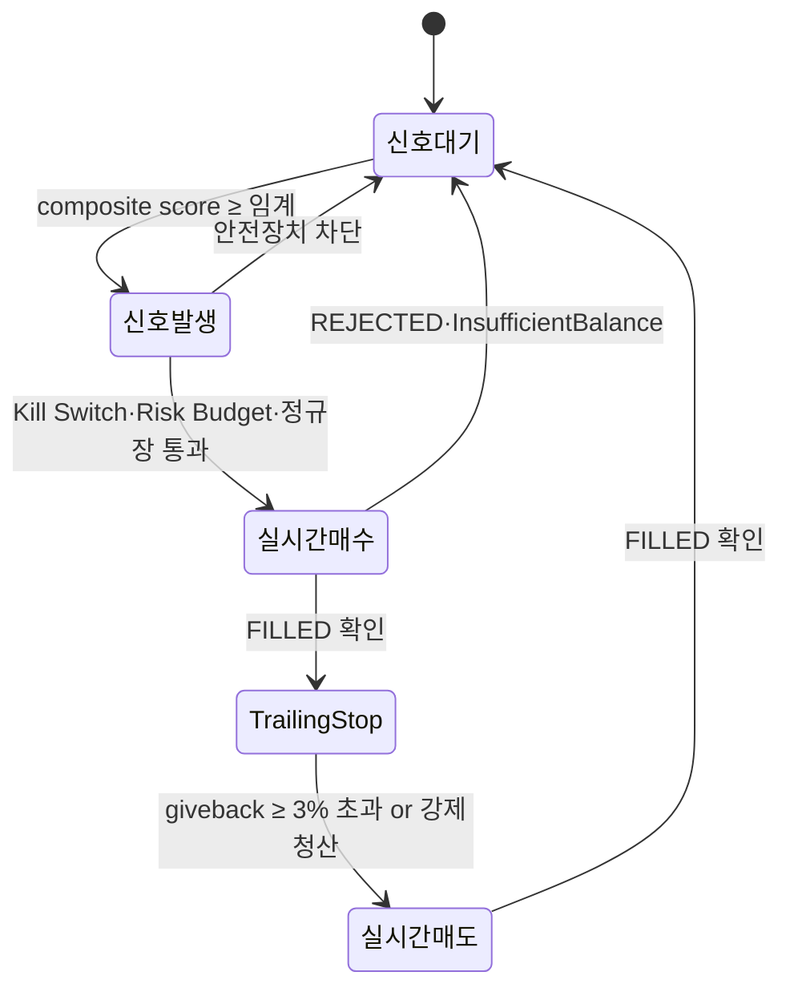

# 🚀 급등주 스나이퍼 · Sprint 1 계획서

**작성일**: 2026-07-11
**작성 근거**: 정체성 재정의 (`project_true_identity`) + 시니어 전문가 재리뷰 §7 S1 + 사용자 확장 (실주문 완결)
**상태**: 🟡 **작성 · 사용자 최종 승인 대기**

---

## 0. 정체성 요약

- **What**: 급등주 사전 예측 봇 · KOSDAQ 테마주 D+0 sniper
- **How**: Toss REST 폴링 tape reader (rankings·trades·orderbook 20~30초) + composite score → **자동 실주문 매수 → Trailing Stop → 자동 매도** 5단계 무한 loop
- **Why**: 밈주 워치 정신 유지 · 안정 수익 봇 아님 · 시드 100만원 100% 손실 감내 원칙

---

## 1. 스코프 (사용자 확장 반영)

### 1-1. 5단계 loop



### 1-2. 하드 파라미터

| 항목 | 값 | 근거 |
|---|---|---|
| **Seed cap** | 1,000,000 KRW | 사용자 지시 · 100% 손실 감내 |
| **Per order 상한** | 100,000 KRW | 기존 EXECUTION_MAX_ORDER_AMOUNT 유지 |
| **동시 보유 종목 상한** | 3종목 | 시드 100만 / 개당 33만 · 초기 신중 |
| **Trailing Stop giveback** | 3% (default) | 전문가 §5-A KR 청산 룰 |
| **하드 손절** | -3% | 초기 5분 내 -3% 시 즉시 청산 |
| **일일 손실 캡** | -3% (30,000 KRW) | Kill Switch 자동 발동 |
| **주간 손실 캡** | -8% (80,000 KRW) | 주말까지 자동 정지 |
| **강제 전량 청산 On/Off** | 기본 On · 사용자 UI에서 Off 가능 | 오버나이트 리스크 회피 (기본) · 사용자 선택 |
| **강제 청산 시각** | 15:00 KST (On 시) | 장 마감 30분 전 |
| **개장 후 활성 시점** | 10:00 KST (개장 1시간 후) | 초기 노이즈 회피 · 전문가 §3 rankings 유효 시점 |

### 1-3. KOSDAQ 유니버스 필터

- 시가총액: 300억 ~ 2조원
- 20일 평균 거래대금: 20억원 이상
- 유통주식수: 3000만주 이하 (squeeze 후보는 500만주 이하 별도 태깅)
- 가격: 1,000원 이상 (동전주 pump 리스크 회피)
- 배제: 투자경고 · 투자위험 · 정리매매 · 관리종목 · 단기과열 지정 예고
- Nightly refresh 22:00 KST (`pykrx` + `finance-datareader`)

### 1-4. Composite Score 공식

```
tape_score = 0.5 × rank_velocity_z + 0.3 × trades_intensity_z + 0.2 × orderbook_imbalance_z

candidate 조건 (AND):
  · tape_score ≥ 2.0 (2 표준편차 이상)
  · rank change: 100위 밖 → 50위권 진입 (30분 이내)
  · trades intensity: 초당 체결건수 60일 baseline 대비 z ≥ 2.5
  · orderbook: 상위 5호가 bid stack z ≥ 2.5
  · warnings 필터 통과 (VI 발동 이력 · 단기과열 없음)
  · 상승률 +2 ~ +7% 구간 (7% 초과는 이미 상투 리스크)
  · 최근 30분 상승 지속 5분 이상 (세력 유도 매물 흡수 회피)
```

---

## 2. 아키텍처

### 2-1. 신규 서브패키지

```
backend/discovery/live_tape/
├── __init__.py
├── universe.py       # KOSDAQ nightly refresh (T38)
├── rankings.py       # rank velocity poller (T39)
├── trades.py         # trades intensity poller (T40)
├── orderbook.py      # orderbook imbalance poller (T41)
├── warnings.py       # VI · 단기과열 필터 (T42)
├── scoring.py        # composite score (T43)
├── trailing_stop.py  # Trailing Stop 관리자 (T48)
└── sniper.py         # 5단계 loop 오케스트레이터 (T50)

backend/api/routes/sniper.py  # UI API (T46)

backend/tests/discovery/test_live_tape.py  # 계약 테스트 (T47)
```

### 2-2. 재활용 컴포넌트

| 재활용 | 어디에서 |
|---|---|
| **TossAdapter** | 실주문 매수/매도 · order_audit |
| **Kill Switch** | 일일 -3% 자동 발동 |
| **Risk Budget** | 종목당 상한 · 일일 손실 캡 |
| **Params store** | Trailing giveback · TP/SL 임계값 편집 |
| **Market Calendar** | 정규장 게이팅 (KR 09:00-15:30) |
| **Rate Limiter** | Toss API 그룹별 스로틀 |
| **Notifier + Profile** | 텔레그램 알림 5단계 각각 |

### 2-3. 데이터 계층 (신규 테이블)

```sql
-- 유니버스 (nightly refresh)
CREATE TABLE live_tape_universe (
  ticker TEXT PRIMARY KEY,
  name TEXT NOT NULL,
  market_cap INTEGER,
  adv_20d INTEGER,           -- 20일 평균 거래대금
  float_shares INTEGER,      -- 유통주식수
  is_squeeze_candidate BOOLEAN DEFAULT 0,
  refreshed_at TEXT NOT NULL
);

-- 랭킹 스냅샷 (rank velocity 계산용)
CREATE TABLE live_tape_ranking (
  id INTEGER PRIMARY KEY AUTOINCREMENT,
  ticker TEXT NOT NULL,
  rank INTEGER,
  volume_amount REAL,
  price REAL,
  return_pct REAL,
  captured_at TEXT NOT NULL
);
CREATE INDEX idx_lt_ranking_ticker_time ON live_tape_ranking(ticker, captured_at);

-- 스나이퍼 진입 로그 (order_audit 이 이미 있으므로 진입 근거 raw 별도)
CREATE TABLE sniper_signal (
  id INTEGER PRIMARY KEY AUTOINCREMENT,
  ticker TEXT NOT NULL,
  detected_at TEXT NOT NULL,
  tape_score REAL,
  rank_velocity REAL,
  trades_intensity REAL,
  orderbook_imbalance REAL,
  order_uuid TEXT,           -- OrderRequest 로 연결
  entry_price REAL,
  exit_price REAL,
  pnl_pct REAL,
  reason TEXT                -- trailing | hard_sl | force_close
);
```

### 2-4. 폴링 예산 (Rate Limit 이내)

Toss `MARKET_DATA` = 8/s 안전 상한 기준:

| 대상 | 폴링 주기 | 초당 req | 종목 수 |
|---|---|---|---|
| rankings (일괄) | 10초 | 0.1 | N/A |
| trades (Tier A) | 20초 | 0.5 | 10 종목 |
| orderbook (Tier A) | 20초 | 0.5 | 10 종목 |
| **소계** | — | **1.1 req/s** | 여유 6.9/s |

Trailing 활성 종목별 추가:
- price polling 5초 · 최대 3 종목 동시 보유 = 0.6 req/s

**총 소모**: ~1.7 req/s · 안전 상한 8/s 대비 21% · **매우 여유**.

---

## 3. 안전장치 통합

### 3-1. 매수 전 6단계 방어

```
신호 감지 → 매수 시도
  ↓
1) Kill Switch active? → 스킵
2) 시드 잔여 < 100,000? → 스킵 (InsufficientBalance 사전 방지)
3) 동시 보유 3 종목 도달? → 스킵
4) 정규장 시간? (10:00 ≤ now < 15:00) → 밖이면 스킵
5) 이미 오늘 진입한 종목? → 스킵 (동일 종목 1일 1회)
6) 종목별 warnings (VI 발동 · 단기과열 · 정리매매)? → 스킵
  ↓
매수 실행 (TossAdapter · 100,000원 시장가)
```

### 3-2. Trailing Stop 로직

```python
# 진입 후 즉시 시작
peak_price = entry_price
while position_open:
    current = get_current_price(ticker)
    if current > peak_price:
        peak_price = current
        continue

    giveback_pct = (current - peak_price) / peak_price
    hard_sl_pct = (current - entry_price) / entry_price

    if giveback_pct <= -0.03:      # peak 대비 3% 하락
        sell_market(ticker, qty)
        break
    if hard_sl_pct <= -0.03:        # 진입가 대비 3% 하락 (5분 내)
        sell_market(ticker, qty)
        break
    if now >= 15:00 KST:            # 강제 청산
        sell_market(ticker, qty)
        break

    sleep(5)  # 5초 폴링
```

### 3-3. 100% 손실 시나리오 (사용자 원칙 검증)

시드 100만원 · 개별 진입 10만원 · 손절 -3% (3,000원 손실) 기준:

- 최악 시나리오: 매수 10건 연속 손절 = -30,000원 → Kill Switch 발동 (일일 -3%)
- 다음 날: Kill Switch 해제 (수동) → 재개 · 잔여 970,000원
- 33일 연속 최악 진행 시 시드 소진 · **자동으로 신규 진입 불가** (InsufficientBalance)

**즉 100% 손실은 33거래일 이상 최악 확률의 누적**. 이 시점까지 루틴이 정확히 동작해야 함.

### 3-4. 오류 회복 (예외 안전)

- Toss API 실패 (500·network) → retry_with_backoff · 3회 후 실패 시 해당 iteration 스킵 (다음 iteration 정상 진행)
- Kill Switch 발동 상태에서 이미 보유 포지션 → Trailing Stop 은 계속 작동 (매도만 가능 · 매수만 차단)
- 프로세스 재기동 → sniper_signal 테이블에서 미청산 포지션 복원 · Trailing 재개
- 정규장 종료 시 미청산 포지션 → 15:00 KST 강제 시장가 청산

---

## 4. Sprint 1 검증 기준 (DoD)

**정성 (기능)**:
- [ ] 5단계 loop 완결 · 재기동 후에도 복원
- [ ] 6단계 매수 방어 각각 실증 (Contract Test)
- [ ] Trailing Stop 정확도 (backtest 대조)
- [ ] 강제 청산 (15:00 KST) 실증
- [ ] 100% 손실 시나리오 (33거래일 시뮬) 정상 종결 · 오류 없음
- [ ] Rate limit 준수 (총 소모 8 req/s 이내 · 로그 검증)
- [ ] 텔레그램 알림 5단계 (신호대기 제외 4단계) 정상

**정량 (성과)** — Sprint 1 목표 아니라 관찰만:
- [ ] Paper 시뮬 30건 이상 진입
- [ ] 승률 · 평균 PnL · MDD · Sharpe 산출

**정량 목표는 Sprint 4 (튜닝 후)** 에 확정. Sprint 1은 **루틴 완결·안전장치 정합만 검증**.

---

## 5. 작업 트리 (T37~T50)

```
[T37] 계획서 (본 문서 · 사용자 승인 대기)
      ↓
[T38] KOSDAQ 유니버스 fetcher (nightly 22:00 KST)
[T42] Warnings 필터 (VI · 단기과열 · 정리매매)   ← 병렬
      ↓
[T39] rankings 폴러 (10초)
[T40] trades 폴러 (20초)                        ← 병렬
[T41] orderbook 폴러 (20초)
      ↓
[T43] Composite score (0.5 rank + 0.3 trades + 0.2 book)
      ↓
[T44] 실주문 매수 (TossAdapter live · 6단계 방어)
[T48] Trailing Stop 관리자 (peak · giveback · hard SL)  ← 병렬
      ↓
[T49] 실주문 매도 + 신호 대기 loop 복귀
[T50] Sniper 오케스트레이터 (5단계 통합 · APScheduler)
[T45] Seed 100만원 + Kill Switch -3% 정합       ← 병렬
      ↓
[T46] Frontend /sniper 페이지 · 5단계 상태·이력·손익
      ↓
[T47] Contract Test · DoD 검증 · 100% 손실 시뮬
```

---

## 6. Not in Scope (Sprint 2+)

- 뉴스 headline 자동 태깅 (Sprint 2)
- 네이버 종토방 · YouTube API 소셜 velocity (Sprint 2)
- US small/micro cap 파이프라인 (Month 2)
- KRX 공매도 잔고 · CTB proxy · 옵션 flow (Sprint 3+)
- 백테스트 자동화 (Sprint 4 · 성과 튜닝 단계에서)

---

## 7. 리스크·회피 (전문가 §8 반영)

| 리스크 | 회피 |
|---|---|
| rank 100→20 진입 시 이미 5~10% 뜬 상투 | rank 100→50 · 상승 +2~7% 구간만 진입 |
| VI 발동 후 진입 상투 | warnings 로 VI 발동 이력 사전 배제 |
| 정리매매·관리종목 무한 하락 | warnings 필터로 강제 배제 |
| 세력 유도 매물 흡수 | 상승 지속 5분 이상 · 최소 거래대금 필터 |
| 오버나이트 갭다운 | 15:00 KST 강제 전량 청산 |
| 통정매매 오인 (반복 진입) | 종목당 1일 1회 하드 · 매매 로그 6개월 보관 |
| Toss API 정책 변경 | KIS Adapter 옵션 코드 백업 유지 (미제거) |
| 시드 조기 소진 | 100% 손실 감내 원칙에 부합 · 시스템 자연 방어 |
| 시스템 로직 오류 | Contract Test 30+ · 100% 손실 시뮬 검증 |

---

## 8. 참조

- 정체성: `[[project_true_identity]]`
- Sprint 1 원칙: `[[project_sprint1_scope]]`
- 전문가 리뷰: 세션 2026-07-11 정정 정체성 기반 재리뷰
- 재활용 컴포넌트: `01-track-c-roadmap.md` (Phase 1~3 코드 그대로 활용)
- Toss API 계약: `03-toss-openapi-integration.md` · `[[reference_toss_open_api]]`

---

## 9. 사용자 최종 승인 대기

이 계획서 기반으로 T38 (KOSDAQ 유니버스) 부터 순차 착수. 승인 시 즉시 개시.
