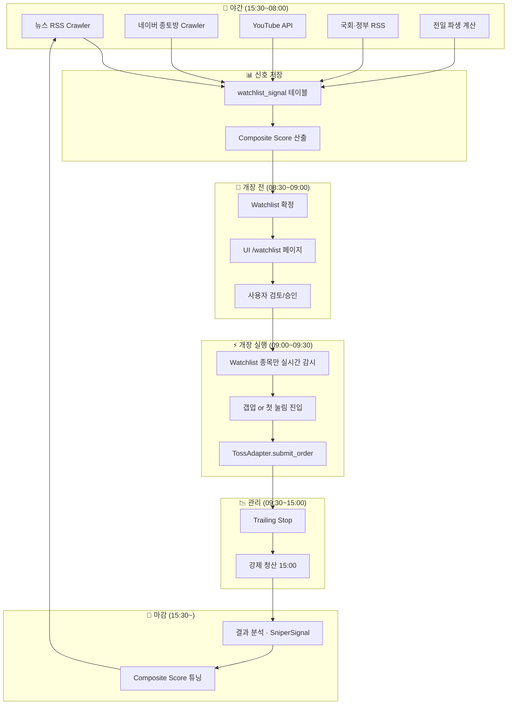

# 🔄 전략 Pivot · AS-IS / TO-BE

**작성일**: 2026-07-13
**결정 근거**: 월요일 개장 후 실증 실패 · 사용자 동업자 관점 지적
**사용자 원문**:
> "위에서 보고한 바로 진행한다면 이미 급등 완료 종목만 잡고 들어가서 손해만 보는 상황이 100% 벌어진다.
> 개장 전 예측 결정 · 마감 후 종목 선택 · 급등 전 매수 이런 원칙이 꼭~! 들어가야 한다.
> 동업자의 관점에서 제발 망하지 않도록 진행하자."

---

## 1. AS-IS · Sprint 1 real-time tape 방식

### 1-1. 설계 의도
- Toss REST 폴링 (rankings 10s · trades 20s · orderbook 20s) 실시간 tape reader
- 정규장 10:00~15:00 KST 활성창에서 candidate 감지 → 즉시 매수
- Trailing Stop 5초 폴링 · 15:00 강제 청산

### 1-2. 실측 결과 (2026-07-13 월요일 개장)

**정상 작동 확인**:
- ✅ APScheduler 잡 · 3 rankings 타입 폴링 · 130 스냅샷 축적
- ✅ 유니버스 매치 5 종목 · rank_velocity 값 유입
- ✅ book_z · rank_z 계산 정상
- ✅ 안전장치 · 인증 · UI 전부 정합

**근본 실패**:
- ❌ candidate 통과 0건 · **정규장 5시간 내내 zero**
- ❌ 매치 종목 모두 이미 급등 완료 상태 (+8~+45%)
- ❌ 진입 조건 return 2~7% 구간에 해당하는 종목 zero

### 1-3. 실패 원인 분석

**A. 감지 소스 자체가 후행**

| 소스 | 감지 시점 | 실제 이벤트 시점 | 지연 |
|---|---|---|---|
| Toss rankings | 거래대금 상위 진입 후 | 매수세 유입 후 | 수십 분~수 시간 |
| Toss trades | 개별 체결 후 | 시장 반응 후 | 초 단위 · 여전히 후행 |
| Toss orderbook | 호가 잔량 반영 후 | 매수 대기 결정 후 | 순간 |

**B. 진입 조건 딜레마**
```
return_min 2% & return_max 7%  ← 계획서 상투 회피
                    ↓
rankings 진입 시점 이미 +8% 이상 → 상시 상투 배제 → candidate 0
                    ↓
완화 시 (return_max 20%)      → 상투 진입 확정 → 손실 100% 시나리오
                    ↓
두 옵션 모두 동일한 손실 경로
```

**C. 정체성 vs 실제 동작**
- **정체성**: 급등주 사전 예측 봇 (밈주 워치 정신)
- **실제**: 급등 진행 종목 감지 (rank이 top100 진입한 후엔 이미 이동 진행)

### 1-4. 남는 자산
- Toss OpenAPI 어댑터 계층 (TossAdapter · TossClient · Rate Limiter)
- 인증 2단 분리 (X-API-Token)
- 안전장치 (Kill Switch · Risk Budget · Trailing Stop · Market Calendar)
- 감사 로그 (order_audit · SniperSignal)
- UI 파라미터 편집기 (33 필드 hot reload)
- APScheduler 잡 계층
- KOSDAQ 유니버스 (nightly refresh · 150 종목)
- Rankings 폴러 (**참고 지표**로 격하 · 진입 트리거 X)

---

## 2. TO-BE · 마감후 예측 + 개장전 결정 + 급등전 매수

### 2-1. 3원칙 (사용자 제시)

1. **마감 후 예측 결정** (15:30 KST 이후 · 야간)
   - 전일 확정 데이터 + 밤 사이 축적 신호로 다음날 후보 확정
   - 사람이 자는 시간에 뉴스·소셜·정부 정책 등 정보 유입 · 이를 자동 수집

2. **개장 전 최종 Watchlist** (08:30~09:00 KST)
   - 누적 신호 → composite score → Top 10~30
   - UI에서 사용자 확인 가능 · 필요 시 수동 조정

3. **급등 전 매수** (09:00~09:30 KST 개장 초 30분)
   - Watchlist 종목만 감시 · 시가 근처 눌림 or 초기 상승 확인 후 진입
   - Real-time tape은 **진입 타이밍 확인 · 상투 회피용 참고**만

### 2-2. 신호 소스 (선행 지표)

#### Layer A · 야간 축적 (15:30~다음 08:00)

**뉴스 headline RSS** (Toss API 아닌 외부):
- 연합인포맥스 (mk.co.kr/etc/rss) · 이데일리 · 파이낸셜뉴스 · 헤럴드경제 · 서울경제
- 5분 주기 폴링 · 종목 keyword 추출 (`006400 삼성SDI`, `LG에너지솔루션` 등)
- 뉴스 시각 vs 종가 · velocity 계산

**네이버 종토방 velocity** (crawler):
- `finance.naver.com/item/board_list.naver?code=XXXXXX`
- 30분 주기 · 게시글수 z-score (60일 baseline)
- 급증 종목 = 다음날 관심 유입 후보

**YouTube Data API v3** (무료 10000 quota/day):
- 채널 신규 upload (한투군 · 슈카월드 · 정프로 · 삼프로TV 등)
- 영상 제목·설명에서 종목명 extract
- 업로드 시각 vs 다음날 시가 gap 상관

**국회 의안정보 API** (`open.assembly.go.kr`):
- 신규 발의 법안 · 위원회 심사 일정
- 관련 산업/종목 매칭 (예: 반도체 지원법 → 소부장)

**정부 부처 보도자료 RSS**:
- 산업부 · 과기부 · 기재부 · 국토부
- 예타 통과 · 예산 편성 · 정책 발표

#### Layer B · 전일 파생 지표

- 상한가 · 갭업 후보 (전일 종가 근처 매수 우세)
- 거래대금 급증 종목 (평시 대비 5배+)
- VI 발동 이력 · 재발동 확률
- 최근 20일 신고가 진입 시점

#### Layer C · 이벤트 캘린더

- FDA/식약처 승인 예정일 (biopharmcatalyst crawl)
- 실적 발표일 (D-3 관심 유입)
- 락업 해제일 (SEC S-1)
- 정치 이벤트 D-1 · 정책 발표일

### 2-3. Composite Score (Watchlist 승격)

```
watchlist_score = 0.35 × news_velocity_z    +   # 뉴스 언급 급증
                 0.25 × board_velocity_z    +   # 종토방 게시글 급증
                 0.15 × youtube_signal      +   # 유튜브 채널 언급
                 0.15 × event_proximity     +   # 이벤트 D-day 근접
                 0.10 × prev_day_derivative     # 전일 파생 지표
```

- watchlist_score ≥ 3.0 → Watchlist 승격 (Top 10~30)
- 임계값 UI 편집 가능 · hot reload

### 2-4. 아키텍처



### 2-5. 재활용·폐기 매트릭스

| 컴포넌트 | 처리 |
|---|---|
| TossAdapter · TossClient · Rate Limiter | ✅ 유지 |
| 인증 계층 (2단 분리) | ✅ 유지 |
| Kill Switch · Risk Budget · Trailing Stop | ✅ 유지 |
| Market Calendar | ✅ 유지 |
| APScheduler 잡 계층 | ✅ 유지 (잡 종류만 변경) |
| KOSDAQ 유니버스 nightly | ✅ 유지 |
| Rankings 폴러 (rankings/trades/orderbook) | 🟡 유지 · **참고 지표로 격하** |
| SniperParams UI 편집기 | ✅ 유지 · 신규 필드 추가 |
| order_audit · SniperSignal | ✅ 유지 |
| **scan_and_enter 30초 스캔** | ❌ 폐기 · 09:00~09:30 단일 실행으로 대체 |
| **is_candidate() 임계 판정** | ❌ 폐기 · Watchlist 승격 판정으로 대체 |
| **score_ticker() 3소스 tape_score** | ❌ 폐기 · watchlist_score 로 대체 |

---

## 3. Sprint 2 로드맵 (4주)

### Week 1 · 야간 신호 수집 파이프라인
- T54: 뉴스 RSS crawler (5개 언론)
- T55: 네이버 종토방 velocity crawler
- T56: YouTube Data API · 채널 감시
- T57: 국회 의안·정부 RSS
- T58: watchlist_signal 테이블 · 저장 계층
- T59: APScheduler 야간 잡 (5분·30분 주기)

### Week 2 · Watchlist 확정 + UI
- T60: composite score (5 요인 가중 합)
- T61: 08:30 개장 전 Watchlist 확정 잡
- T62: UI /watchlist 페이지 (Watchlist Top 30 · 신호 소스별 breakdown)
- T63: 사용자 수동 편집 (add/remove/lock)

### Week 3 · 개장 실행 로직
- T64: 09:00~09:30 execute_watchlist 잡
- T65: 갭업/눌림 진입 로직 (시가 대비 매수)
- T66: Rankings 참고 지표로 사용 (진입 confirm 만)
- T67: Contract Test (mock 시나리오)

### Week 4 · Forward Test · 튜닝
- T68: 5거래일 Paper 시뮬 forward test
- T69: 결과 분석 · composite score 가중치 튜닝
- T70: Sprint 2 DoD 검증 (승률 · 평균 PnL · MDD)

## 4. 성공 지표 (Sprint 2 DoD)

- 매일 Watchlist Top 30 자동 생성 · 08:30 KST 완료
- 5거래일 forward test 완주
- Watchlist 종목 중 실제 급등 (D-day +5% 이상) 비율 ≥ 30%
- Paper 시뮬 승률 ≥ 45% · R:R 2:1 이상 · MDD -15% 이내

## 5. 참조

- 전신: `docs/plans/sniper/00-sprint1-plan.md` (폐기 근거)
- 전문가 리뷰 §7 Sprint 2: 뉴스·종토방·YouTube leading 소스 (오늘 결정으로 예정 그대로)
- 정체성: `[[project_true_identity]]`
- Pivot 근거: `[[project_strategic_pivot_pre_market]]`
