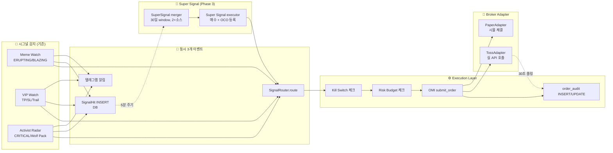
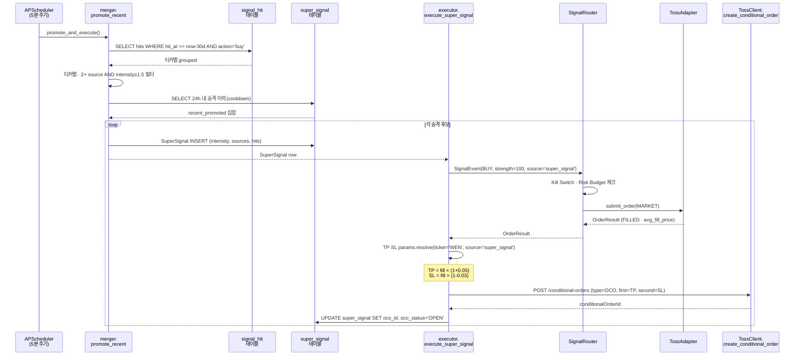
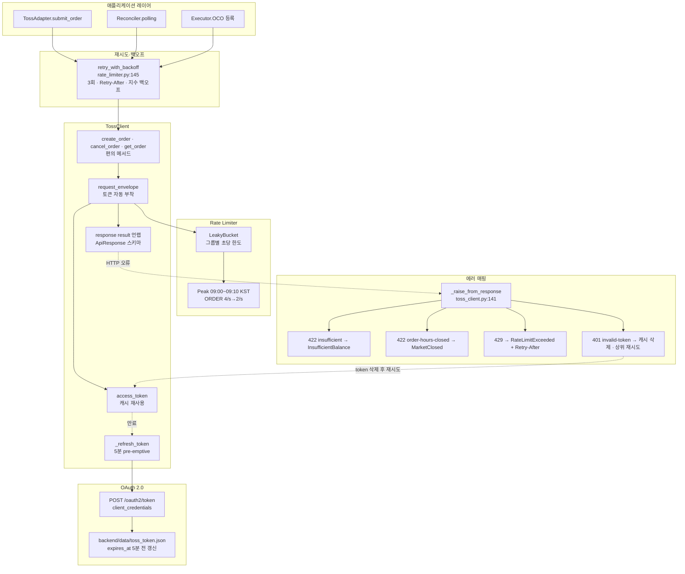
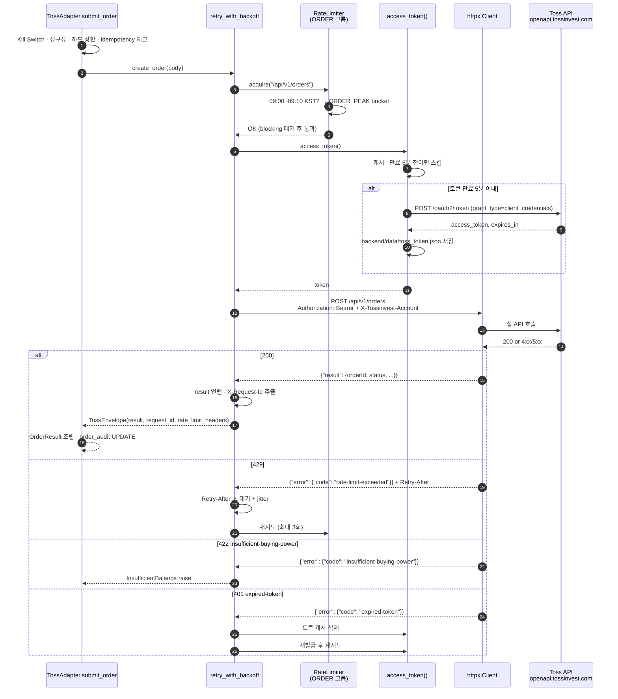

# 🔍 Runtime Flow — 시각화된 동작 설명

**작성일**: 2026-07-11
**목적**: 사용자가 "전체 데이터 흐름 · 안전장치 발동 · Super Signal 오케스트레이션 · Toss HTTP 계층" 4가지를 그림·시나리오·코드 라인 참조로 이해할 수 있게 함.
**대상**: 이미 Phase 1~3 커밋된 코드 (`main` 로컬 6~7 커밋 선행)

---

## §1. 전체 데이터 흐름 (시그널 → 주문 → 이벤트)

### 1-1. 큰 그림



### 1-2. 코드 참조

| 단계 | 실제 파일:라인 | 역할 |
|---|---|---|
| A1 Meme 감지 | `backend/discovery/meme_watch/alert.py:202` | ERUPTING/BLAZING 판정 후 telegram · SignalHit · Router 병렬 호출 |
| A2 VIP 이벤트 | `backend/discovery/vip/vip_watch.py:68` | TP1/TP2/STOP/TRAIL_GIVEBACK 감지 |
| A3 Activist 알림 | `backend/discovery/activist/notifier.py:71` (send_event), `:130` (send_wolf_pack) | CRITICAL/REGIME_CHANGE + Wolf Pack |
| B1 텔레그램 | `backend/services/notifier.py:84` | TelegramNotifier.send() · 프로파일 필터 통과 |
| B2 SignalHit | `backend/discovery/super_signal/signal_hit.py:16` | record_hit() INSERT · Router 실패해도 시도 |
| B3 Router | `backend/execution/signal_router.py:132` | route() · Kill Switch · Risk Budget · OMI |
| C1 Kill Switch | `backend/execution/signal_router.py:157` | is_active() 체크 · True 면 None 반환 |
| C2 Risk Budget | `backend/execution/signal_router.py:178` | check() · 종목당 상한 · 일일 손실 캡 |
| C3 OMI | `backend/execution/order_manager.py:20` | submit_order ABC · 실 구현체 Paper/Toss |
| C4 감사 | `backend/execution/audit.py:32` | record_order_result() · order_audit UPDATE |
| D1 Paper | `backend/execution/brokers/paper_adapter.py:200` | 시뮬 체결 · 실계좌 sync 기반 |
| D2 Toss | `backend/execution/brokers/toss_adapter.py:83` | 실 API POST /orders |
| E1 Merger | `backend/discovery/super_signal/merger.py:29` | promote_recent() 30일 window |
| E2 Executor | `backend/discovery/super_signal/executor.py:47` | 매수 진입 + OCO 등록 |

### 1-3. 예시 시나리오 (WEN)

**타임라인 (US 정규장 · EXECUTION_ENABLED=true 가정)**:

1. **09:35 KST 개장 직후** — Activist Radar 가 SEC 13D 필링 감지 (Elliott Management)
   - `send_event()` → 텔레그램 "🐺 Elliott · 13D · WEN"
   - `record_hit(ticker='WEN', source='activist', strength=90)` → SignalHit INSERT
   - `SignalRouter.route(SignalEvent(action='buy', strength=90))` 호출
     - Kill Switch 비활성 → 통과
     - Risk Budget 통과 (WEN 종목 상한 10% 이내)
     - `PaperAdapter/TossAdapter.submit_order()` 호출
     - 감사 로그 INSERT

2. **10:12 KST** — Meme Watch 가 ERUPTING 감지 (velocity 급등)
   - 위와 동일 3 이벤트 (source='meme_stock', strength=80)

3. **10:15 KST** — Super Signal 5분 스케줄러 자동 실행 (`promote_and_execute`)
   - WEN 이 activist + meme_stock 2소스 히트 · intensity = 0.9×3 + 0.8×1 = **3.5** ≥ 1.5
   - `SuperSignal` INSERT (승격)
   - `execute_super_signal()` → SignalRouter (source='super_signal', strength=100) → 매수
   - **OCO 자동 등록**: TP $8.08 · SL $7.60 (5%/-3% · WEN 종목별 override 반영)

4. **11:47 KST** — Reconciler 30초 폴링에서 TP 체결 감지
   - `order_audit` UPDATE (status=FILLED · avg_fill_price=8.08)
   - OCO 나머지 (SL) 는 Toss 서버가 자동 취소

---

## §2. 안전장치 발동 조건 매트릭스

Kill Switch · Risk Budget · 정규장 게이팅 · 하드 상한 · 프로파일 필터 5개 안전장치가 언제 발동하는지 시나리오별로 정리.

### 2-1. 시나리오별 트리거·응답

| 시나리오 | 어느 장치가 작동? | 어디서 (파일:라인) | 사용자 알림 |
|---|---|---|---|
| Paper 어댑터 · 매수 잔고 초과 | ① InsufficientBalance (Paper 내부) | `paper_adapter.py:322` | Router 감사 로그 REJECTED |
| Toss 어댑터 · 종목당 10% 상한 초과 | ② Risk Budget `per_ticker_max_pct` | `risk_budget.py:53` | Router 감사 로그 REJECTED · 텔레그램 X (Phase 4 예정) |
| Toss 어댑터 · 일일 손실 캡 -3% 근접 (트리거 -2.1%) | ③ Risk Budget `daily_loss_limit` | `risk_budget.py:78` | 위와 동일 |
| Toss 어댑터 · 주문 금액 10만원 초과 | ④ TossAdapter 하드 상한 | `toss_adapter.py:107` | InsufficientBalance raise · 감사 REJECTED |
| Toss 어댑터 · KR 휴장 시 매수 시도 | ⑤ Market Calendar 로컬 게이팅 | `toss_adapter.py:97` | MarketClosed raise · Toss 서버까지 안 감 |
| Kill Switch 활성 · 신규 매수 시도 | ⑥ Kill Switch (Router + 어댑터 이중) | `signal_router.py:156`, `toss_adapter.py:87` | KillSwitchActive raise |
| 관리자 수동 Kill Switch 발동 | ⑥ · 텔레그램 🚨 URGENT 즉시 발송 | `kill_switch.py:110` | force=True 로 프로파일 우회 |
| 09:03 KST 개장 직후 주문 · rate limit 6/s→2/s | ⑦ Rate Limiter 피크 스로틀 | `rate_limiter.py:80` | 요청 blocking (사용자 대기) |
| Toss 429 응답 | ⑦ Rate Limiter Retry-After + 백오프 | `rate_limiter.py:145` | 3회 재시도 후 실패 시 RateLimitExceeded |
| TELEGRAM_PROFILE=SNIPER · 밈주 알림 | ⑧ Notifier Profile 필터 | `notifier.py:107` | 발송 스킵 (SNIPER 는 SUPER + URGENT 만) |
| TELEGRAM_PROFILE=WATCH · 모든 알림 | ⑧ · 30분 배치 큐잉 | `notifier_profile.py:87` | 30분 후 요약 1건 발송 |

### 2-2. 이중 방어 지점 (안전 우선)

**Kill Switch**: Router (`signal_router.py:156`) 와 어댑터 (`toss_adapter.py:87`) 양쪽 체크. Router 를 우회한 수동 호출도 어댑터가 다시 방어.

**Insufficient/MarketClosed**: 어댑터 로컬 검증 후에도 Toss 서버가 422 반환 시 `toss_client.py:151` 에서 예외 계층으로 정규화.

**하드 상한**: TossAdapter 만 있음 (Paper는 자기 자본 시뮬이라 불필요). USD 종목은 실시간 환율로 KRW 환산 후 판정 (`toss_adapter.py:239`).

### 2-3. 발동 이력 확인

| 어떤 장치 | 어디서 확인 |
|---|---|
| Kill Switch 이력 | `data/kill_switch.json` · Frontend `/execution` 상단 |
| Risk Budget 위반 | `order_audit` 테이블 · `status=rejected` · `error_code=risk-budget-*` |
| MarketClosed 로컬 거부 | 로그만 (audit 미기록 · Phase 4 개선 예정) |
| Rate Limit 스로틀 | 로그: `[rate acquire (PEAK) · ORDER · /api/v1/orders]` |
| 프로파일 필터 스킵 | 로그: `[Notifier] 프로파일 필터 skip: <title>` |

---

## §3. Super Signal 자동 매매 오케스트레이션

Phase 3의 킬러 기능 · 다중 시그널 병합 → 자동 매수 → OCO 익절/손절 원자 세팅의 전 과정.

### 3-1. 5분 스케줄러 시퀀스



### 3-2. 스코어링 상세

**공식**:
```
intensity = Σ (hit.score × source_weight[hit.source])
```

**가중치**:
- `activist`: **3.0** (SEC 필링 · Wolf Pack · 이벤트 확률 최상)
- `vip`: **2.0** (감시 대상 확정성)
- `meme_stock`: **1.0** (변동성 · 지속성 낮음)

**임계값**:
- 승격: **2개 이상 소스** AND **intensity ≥ 1.5** (예: activist 0.5 + vip 0.5 = 1.5)
- 재승격 cooldown: **24시간** (같은 티커 반복 승격 방지)

**예시 계산**:
- WEN: activist(0.9) + meme(0.8) = 0.9×3 + 0.8×1 = **3.5** → 승격 ✅
- TTD: meme(0.5) 단일 = **0.5** → 소스 1개 → 승격 X
- XYZ: meme(0.1) + vip(0.2) = 0.1×1 + 0.2×2 = **0.5** → 임계 미달 → 승격 X

### 3-3. OCO 조건주문 원자 세팅

```json
POST /api/v1/conditional-orders
{
  "clientOrderId": "ttboco-6c0058ac",
  "type": "OCO",
  "symbol": "WEN",
  "quantity": "13",
  "orderType": "LIMIT",
  "expireDate": "2026-08-10",
  "first":  { "orderSide": "SELL", "triggerPrice": "8.08", "orderPrice": "8.08" },
  "second": { "orderSide": "SELL", "triggerPrice": "7.60", "orderPrice": "7.60" }
}
```

**중요 성질**:
- 두 조건이 동시에 감시됨
- **하나가 체결되면 나머지는 서버 측에서 자동 취소** (One-Cancels-the-Other)
- 만료일까지 미체결 시 자동 만료 (기본 30일)
- 인간 개입 0 · "실현손실 0" 대원칙 반영

### 3-4. 실행 결과 확인

Frontend `/super-signals` 페이지:
- 승격 카드에 **entry_price / TP / SL / oco_status** 표시
- OCO 상태 배지: `OPEN` (감시 중) · `TRIGGERED` (체결) · `CANCELED` (취소)
- 기여 히트 목록 (source · signal_id · score · at) 펼치기

---

## §4. Toss OpenAPI 실제 HTTP 호출 구조

토큰 → 헤더 → rate limit → 재시도 → 응답 파싱 → 예외 매핑까지 계층 구조.

### 4-1. 호출 계층



### 4-2. 주문 요청 실제 시퀀스



### 4-3. Rate Limit 그룹 매트릭스

| 그룹 | Toss 상한 | 안전 상한 (본 구현) | 피크 (09:00~09:10) |
|---|---|---|---|
| `AUTH` (토큰) | 5/s | 1/s (캐시 재사용) | — |
| `ACCOUNT` | 1/s | 0.5/s | — |
| `ASSET` (holdings) | 5/s | 3/s | — |
| `ORDER` (주문) | 6/s | 4/s | **2/s (강제 하향)** |
| `ORDER_INFO` (buying-power) | 6/s | 4/s | **2/s** |
| `MARKET_DATA` (시세) | 10/s | 8/s | — |
| `MARKET_DATA_CHART` (캔들) | 5/s | 3/s | — |
| `CONDITIONAL_ORDER` (OCO) | 5/s | 3/s | — |
| `MARKET_INFO` (calendar) | 3/s | 2/s | — |

### 4-4. 응답 파싱 계약

**공통 성공 envelope** (실측 · 스펙 문서엔 없음):
```json
{ "result": <endpoint-specific> }
```

**공통 실패 envelope**:
```json
{ "error": { "requestId": "...", "code": "...", "message": "...", "data": {...} } }
```

- 성공 시 `result` 자동 언랩 (`toss_client.py:186`)
- 실패 시 `_raise_from_response` 로 예외 정규화 · `X-Request-Id` 는 감사 로그에 반드시 기록
- `orders?status=` 는 **그룹 라벨 OPEN/CLOSED** (개별 PENDING X · 실측 반영 · 문서 §3-3)

### 4-5. 감사 로그의 X-Request-Id 활용

Toss 지원 요청 시 필수. 우리는 `TossEnvelope.request_id` 에 저장 후:
1. Router 가 `record_order_result()` 로 `order_audit.raw_response` JSON 안에 `request_id` 필드로 기록
2. Reconciler 도 폴링마다 신규 request_id 추가 (`raw_response.reconciles` 배열)
3. Frontend `/super-signals` 상세에서 표시

CS 문의 시 요청 ID + 시간만 알려주면 Toss 측이 로그 조회 가능.

---

## 참조

- **전신 문서**: `01-track-c-roadmap.md` · `02-omi-interface-spec.md` · `03-toss-openapi-integration.md`
- **메모리**:
  - `reference_toss_open_api` — 스펙 요약 + 실측 계약
  - `feedback_verify_existing_state_before_action` — 서비스 기동 전 사전 확인
  - `feedback_configurability_first` — 하드코딩 default 대신 override
- **다음 단계 (사용자 승인 대기)**:
  - B-1 · 자동매매 On/Off UI 토글
  - B-2 · 실시간 모니터링/타임라인
  - B-3 · 수량·금액 사이징 개선 (Kelly/Vol Targeting)
  - B-4 · 수동 주문 버튼
